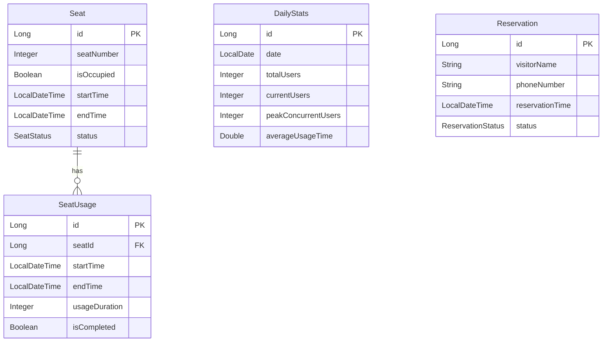

# 닌텐도 행사 전산 관리 시스템

## 📌 프로젝트 소개
- **개발 기간**: 3일
- **인원**: 1명 (개인 프로젝트)
- **목적**: 닌텐도 체험 행사장의 좌석 관리 및 이용자 통계 시스템

## 🖥 사용 화면
### 메인 화면
<table>
 <tr>
   <td></td>
   <td></td>
   <td></td>
 </tr>
 <tr>
   <td></td>
   <td></td>
   <td></td>
 </tr>
</table>

## 🛠 주요 기능
### 1. 실시간 좌석 관리
- 51대의 닌텐도 기기 실시간 모니터링
- 좌석별 상태 표시 (사용 가능/사용 중/경고/종료)
- WebSocket을 통한 실시간 상태 업데이트
- 종료 5분 전 경고 표시 (노란색)
- 종료 시 상태 표시 (빨간색)

### 2. 통계 관리
- 일별 총 이용자 수 집계
- 평균 이용 시간 계산
- 최대 동시 이용자 수 기록
- 현재 이용자 수 실시간 표시

### 3. 예약 관리
- 대기자 등록 및 관리
- 실시간 대기 순서 확인
- 연락 상태 표시 기능

## 🔧 기술 스택
### Backend
- Java 17
- Spring Boot 3.x
- Spring Data JPA
- WebSocket
- MySQL 8.0

### Frontend
- Thymeleaf
- JavaScript
- Bootstrap 5
- WebSocket

### Infrastructure
- Docker
- Docker Compose

## 💾 데이터베이스 설계

🚀 주요 구현 사항

실시간 시간 관리

스케줄링을 통한 1분 단위 시간 업데이트
WebSocket을 활용한 실시간 클라이언트 상태 동기화

상태 관리 시스템

좌석별 독립적인 상태 관리
이용 시작/종료 시점 자동 기록
상태별 시각적 피드백 제공

통계 시스템

실시간 통계 데이터 수집 및 표시
일별 이용 현황 자동 집계

📝 실행 방법
# Docker 환경 구성
docker-compose up -d

# 애플리케이션 실행
./gradlew bootRun

초기에 DB 에 SEAT 테이블에 필요 개수만큼 insert가 필요합니다

❗ 개선 사항 및 회고
아쉬운 점

빠듯한 작업 일정으로 인한 코드 품질 개선 필요
단위 테스트 부재
에러 처리 체계 보완 필요

개선 계획

서비스 계층의 책임 분리
예외 처리 고도화
로깅 시스템 보강
성능 모니터링 시스템 도입

성과

클라이언트 요구사항 100% 충족
안정적인 실시간 데이터 처리 구현
직관적인 UI/UX 제공

